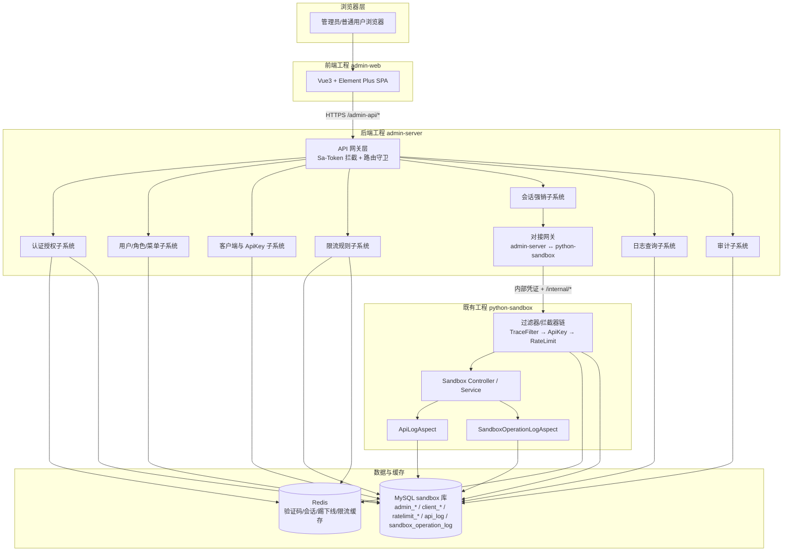
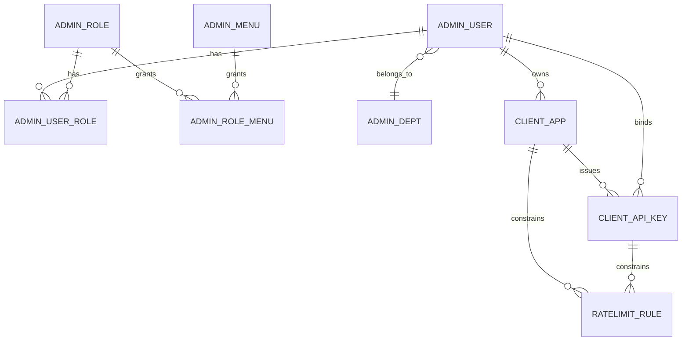

# 架构设计文档 — Python Sandbox 管理端

> 文档版本：v1.0（Design 初稿）
> 输入：`.cospec/admin/requirements.md`（v1.0，仓库根 `d:/workspaces/j-sandbox`）
> 输出语言：简体中文
> 文档定位：面向后续任务拆分（Task agent）与实现阶段（Code agent）的"架构基线"；只描述"模块如何组织、组件如何交互、关键流程如何串通"，不写代码、不写 SQL、不写非功能性指标。
> 适用项目：在当前仓库（`d:/workspaces/j-sandbox`）下新增 `admin-web`（前端）与 `admin-server`（后端）两个工程，并对既有 `python-sandbox` 做必要的接口/拦截器改造。

---

## 0. 阅读须知与硬约束

本设计文档遵守以下硬约束，任一项违反即视为不合格：

* 不含任何具体代码实现、Java/SQL/TS/Vue 代码片段或注解样板。
* 不含性能、容量、SLA、可用性、并发数等非功能性需求。
* 不含监控、日志采集、告警阈值、指标埋点、链路追踪后端（`traceId` 透传作为已有能力沿用，不在本设计新增监控系统）。
* 不含索引优化、SQL 调优、分库分表、读写分离等数据库优化方案。
* 不含单元测试、功能测试、集成测试、覆盖率与测试金字塔。
* 不含 Docker / K8s / Nginx / CI-CD / HTTPS 证书 / 反向代理等部署设计。
* 不含 DDL/DML/SQL 细节；schema 增量仅描述"方向与命名约定"。
* 沿用需求文档已确认的 8 项默认决策（详见 §12）。

---

## 1. 架构概述

### 1.1 架构目标

* **可扩展性**：管理端业务按"认证授权 / 客户端与凭证 / 限流 / 会话 / 日志 / 审计"六大领域拆分子系统，后续新增模块（如通知公告、组织架构）不破坏既有边界。
* **可维护性**：与既有 `python-sandbox` 工程在仓库层物理隔离（独立 Maven / 独立前端工程），但共用同一 MySQL 库与同一 Redis 实例，避免引入跨库事务。
* **演进友好**：现有 SDK 接口契约（`/api/sandbox/*`）保持稳定，管理端不破坏既有字段语义，仅以"扩展列 + 灰度开关"的形式向前演进。

### 1.2 架构原则

* **单一职责**：管理端后端只承担"管理域"业务（CRUD、权限、聚合查询、对接 `python-sandbox`），不重新实现沙箱执行能力。
* **开闭原则**：新增管理端模块时，不修改既有 `python-sandbox` Controller 方法签名，仅在"过滤器 / 拦截器 / Aspect"与"实体扩展字段"两个出口扩展。
* **里氏替换**：管理端→`python-sandbox` 的"内部调用凭证"独立于"客户端 ApiKey"，两者鉴权通道互不替代。
* **接口隔离**：管理端 UI 与后端之间只暴露业务接口；管理端后端与 `python-sandbox` 之间只暴露"对接接口集"，不暴露 `python-sandbox` 内部沙箱执行细节。
* **依赖倒置**：管理端后端对 `python-sandbox` 的调用通过抽象的"对接层网关（admin-server 内部）"完成，避免 Controller 直接硬编码 HTTP 路径。

### 1.3 三个工程模块的角色

| 模块 | 角色 | 关键职责 |
|------|------|----------|
| `admin-web` | 浏览器端管理 UI | 登录、CRUD、可视化、按钮级权限 |
| `admin-server` | 管理域业务中枢 | RBAC、客户端/ApiKey、限流规则、会话强销、聚合日志查询、对接 `python-sandbox` |
| `python-sandbox`（既有） | 沙箱执行与日志落库 | 提供 `/api/sandbox/*` 的 ApiKey 校验入口、限流执行点、活跃会话枚举、强销接口，并扩展 `api_log` / `sandbox_operation_log` 字段 |

三者之间的关系可表述为：**`admin-web` → `admin-server` → `python-sandbox` → MySQL**；`admin-server` 不直接连接 Docker。

---

## 2. 系统架构

### 2.1 整体架构图（C4 语境：Container 级）



### 2.2 部署拓扑（高层级，不含具体端口与编排）

```
┌────────────────┐     ┌──────────────────┐     ┌──────────────────┐
│   admin-web    │ ──> │   admin-server   │ ──> │  python-sandbox  │
│  (静态资源)    │     │ (SpringBoot3)    │     │  (SpringBoot3)   │
└────────────────┘     └──────────────────┘     └──────────────────┘
                              │                          │
                              ▼                          ▼
                       ┌─────────────┐            ┌─────────────┐
                       │   Redis     │            │   MySQL     │
                       └─────────────┘            └─────────────┘
```

* `admin-web` 与 `admin-server` 解耦部署；`admin-web` 通过 `/admin-api` 路径访问 `admin-server`。
* `admin-server` 与 `python-sandbox` 部署在同一网络域，两者之间的"对接调用"使用内部共享凭证（详见 §5.4、§10）。
* MySQL 与 Redis 为既有依赖，本次设计不引入新的中间件。

### 2.3 架构分层

| 层 | 模块 | 关注点 |
|----|------|--------|
| 表示层 | `admin-web` | 路由、组件、权限指令、UI 规范 |
| 网关层 | `admin-server` 网关 | 鉴权、响应包装、异常统一处理、跨域 |
| 业务层 | `admin-server` 业务子系统 | RBAC、客户端/ApiKey、限流、会话、日志、审计 |
| 对接层 | `admin-server` `Bridge` | 调用 `python-sandbox` 内部接口的统一出口 |
| 执行层 | `python-sandbox` Controller / Service | 沙箱执行（沿用既有） |
| 横切层 | Filter / Interceptor / Aspect | traceId、ApiKey 校验、限流、日志落库 |

---

## 3. 模块边界与命名空间

### 3.1 工程与目录

#### 3.1.1 前端工程 `admin-web`

* 路径前缀：`admin-web/`（仓库一级目录）
* 工程脚手架：Vite + Vue3 + TypeScript + Pinia + Vue Router + Axios + Element Plus
* HTTP 基座：所有请求统一通过 `/admin-api` 前缀转发至 `admin-server`
* 状态管理：Pinia（用户态、菜单态、权限态、字典态）
* 路由：静态路由（登录、404、403）+ 动态路由（基于后端返回的菜单树）
* 入口约束：仅暴露 `index.html` 与静态资源；构建产物由独立容器/静态服务承载

#### 3.1.2 管理端后端 `admin-server`

* 路径前缀：`admin-server/`（仓库一级目录）
* 构建：Maven 模块（与 `python-sandbox` 平级，不嵌入其 POM）
* API 前缀：`/admin-api/**`
* 端口：与 `python-sandbox` 分离，避免与既有 `/api/sandbox/*` 冲突
* 包结构建议：`io.github.sandbox.admin.{auth, rbac, client, apikey, ratelimit, session, log, audit, bridge, common}`

#### 3.1.3 既有 `python-sandbox`

* 路径前缀：`python-sandbox/`（仓库一级目录，既有工程）
* 接口路径保持 `/api/sandbox/**`，不被管理端占用
* 本次设计仅在 Filter / Interceptor / Aspect / Entity 四个出口扩展，不修改 Controller 业务方法签名

### 3.2 端口与命名空间约定

| 维度 | 管理端 | python-sandbox | 备注 |
|------|--------|----------------|------|
| HTTP 路径前缀 | `/admin-api` | `/api/sandbox` | 互不重叠 |
| 数据库 schema | 同 MySQL `sandbox` 库 | 同 MySQL `sandbox` 库 | 共库不同表 |
| 表名前缀 | `admin_*` / `client_*` / `ratelimit_*` / `sys_*` | （沿用 `api_log` / `sandbox_operation_log`） | 蛇形命名 |
| Redis Key 前缀 | `admin:` | `sandbox:` | 避免 key 冲突 |
| 内部凭证 Header | `X-Admin-Internal-Token` | （被校验方） | 仅 admin-server ↔ python-sandbox |
| 追踪 Header | `X-Trace-Id` | `X-Trace-Id` | 沿用既有 |

---

## 4. 管理端后端核心组件设计（高层级）

> 本节描述"组件分层 + 关键机制"，不含 Java 类定义、注解用法或方法签名。

### 4.1 分层架构

`admin-server` 内部采用经典的三层 + 横切层结构：

* **Controller 层**：薄层，仅做参数接收、校验、调用 Service、返回统一响应包装。
* **Service 层**：业务编排，事务边界与权限过滤的主要承载点。
* **Mapper 层（MyBatis Plus）**：单表 CRUD 与复杂查询；复用 `BaseMapper`。
* **横切层**：Sa-Token 拦截、参数校验、统一异常处理、操作日志切面。

Service 与 Controller 之间通过 DTO/VO 隔离内部实体，避免持久层对象直接外泄。

### 4.2 Sa-Token 鉴权配置

* **登录态载体**：使用 Sa-Token 的 token 模型，token 写入浏览器 Cookie（默认 `Authorization` 头携带）。
* **会话存储**：登录态、可被踢下线标记、踢下线通知均通过 Sa-Token 的 Session + Redis 实现，命名空间 `admin:session:*`。
* **踢下线机制**：登录成功后 Sa-Token Session 写入唯一"账号-会话映射"键（`admin:account-online:{userId}`），登录或踢下线时刷新该键；其他端下次访问触发"账号已在别处登录"语义并强制下线。
* **"记住我"持久 Token**：发放一个独立的长期 token（命名空间 `admin:remember:*`，TTL 取系统设置中的"最长免登天数"），写入 HttpOnly Cookie；前端启动时携带该 token，由独立过滤器识别后自动续登并刷新短期 token。
* **跨域与前端指令**：前端通过 Sa-Token 暴露的"当前账号权限码集合"驱动 `v-permission` 指令，控制按钮级显隐。
* **未登录 / 无权限 / 被踢下线**三类语义在网关层被翻译为统一的错误码。

### 4.3 图形验证码方案

* 选型：在 Easy-Captcha（图形）与 Kaptcha 之间选型。优先 **Easy-Captcha**，理由：
  * 与 SpringBoot3 / Jakarta Servlet API 兼容，依赖轻量。
  * 支持"算式 / 字符 / GIF"等样式，便于登录页视觉风格统一。
  * 自带"无侵入式"前端对接示例，缩短联调时间。
* 使用方式：
  * 登录页加载时调用 `/admin-api/auth/captcha` 获取 `captchaId` 与图片 base64。
  * 登录提交时携带 `captchaId` 与 `userAnswer`；校验仅校验"是否过期 / 是否正确"，**不消耗登录失败次数**。
  * 校验通过后立即删除 Redis 中对应键（命名空间 `admin:captcha:*`，TTL 与前端倒计时一致）。
* "失败 N 次前几次要求验证码"由网关层基于"账号维度的失败计数"判断；计数键命名空间 `admin:login-fail:{userId}`。

### 4.4 MyBatis Plus 通用 BaseEntity 与自动填充

* 所有管理端业务实体继承统一的 `BaseEntity`，包含 `id / createTime / updateTime / createBy / updateBy / deleted`（逻辑删除）。
* 自动填充策略：
  * `createTime / updateTime`：由 MyBatis Plus `MetaObjectHandler` 在插入/更新时填充。
  * `createBy / updateBy`：从 Sa-Token 当前用户上下文解析后填充；登录前（如初始化种子数据）置为 `system`。
  * `deleted`：逻辑删除标志位，默认 0；删除时由框架自动改写为 1。
* 主键策略：`IdType.ASSIGN_ID`（雪花 ID）或 `AUTO`，由具体实体决定；管理端业务表统一一种风格以降低心智负担。

### 4.5 Redis 在本项目中的具体使用点

| 用途 | Key 前缀 | TTL | 写入方 | 读取方 |
|------|----------|-----|--------|--------|
| 图形验证码 | `admin:captcha:{captchaId}` | 5 分钟 | 登录页加载 | 登录提交 |
| 登录失败计数 | `admin:login-fail:{userId}` | 锁定时长一致 | 网关层 | 网关层 |
| 账号在线映射（踢下线） | `admin:account-online:{userId}` | 短期 token 同寿命 | 网关层登录成功 | 网关层每次请求 |
| 短期 token Session | `admin:session:{token}` | 短期 token 同寿命 | Sa-Token | Sa-Token |
| 长期"记住我"token | `admin:remember:token:{token}`（+ 反向索引 `admin:remember:user:{userId}`） | 配置项"最长免登天数" | 登录/续登 | 自动续登 |
* 不在 Redis 中缓存业务数据（如客户端列表、ApiKey 明细）；避免缓存与 DB 一致性问题。
* 不在 Redis 中保存 ApiKey 明文；明文只存活于"生成瞬间"的服务端内存中，并在一次性展示响应后立即丢弃。

### 4.6 全局异常处理与统一响应

* **统一响应包装**：所有 `admin-api` 接口以统一结构返回（详见 §10），含业务码、业务消息、数据体、时间戳。
* **全局异常处理**：
  * `BusinessException` → 业务级错误码，HTTP 状态与业务码解耦。
  * `BindException` / `MethodArgumentNotValidException` → 参数校验错误，翻译为"字段级错误"返回。
  * `NotLoginException` / `NotPermissionException` / `NotRoleException` → Sa-Token 三类异常，分别翻译为"未登录 / 无权限 / 角色不足"。
  * `DisableLoginException` → 账号被停用语义。
  * 兜底异常 → 不暴露堆栈，仅返回"系统繁忙"。
* **跨域**：通过统一的 CORS 配置开放 `admin-web` 来源；不在每个 Controller 单独处理。

### 4.7 参数校验

* 入参 DTO 使用 Bean Validation（`@NotNull` / `@Size` / `@Pattern` 等）标注。
* Controller 层配合 `@Valid` 触发；校验失败被全局异常处理捕获并以"字段错误数组"返回。
* 路径参数、查询参数使用接口级 `@Validated` 配合参数级约束。
* 业务规则校验（"客户端编码唯一"等）放在 Service 层，翻译为 `BusinessException`。

---

## 5. RBAC 数据模型与权限模型

### 5.1 实体关系



### 5.2 实体职责

| 实体 | 关键字段语义 | 约束 |
|------|--------------|------|
| `admin_user` | 用户名（唯一）、昵称、邮箱、手机、头像、状态、最后登录时间、密码哈希、盐、登录失败次数、锁定到期时间、是否首次登录、所属部门 | 用户名唯一；含软删除 |
| `admin_role` | 名称、权限字符（如 `common`）、排序、状态、备注、是否内置 | 权限字符唯一；内置角色不可删 |
| `admin_menu` | 父级、类型（目录/菜单/按钮）、名称、图标、排序、路由、组件、是否外链、是否缓存、是否可见、权限字符 | 树形结构；权限字符可空 |
| `admin_user_role` | 用户 ID、角色 ID | 联合主键 |
| `admin_role_menu` | 角色 ID、菜单 ID | 联合主键 |
| `admin_dept`（可选） | 父级、名称、负责人、排序、状态 | 树形；不引入时退化为可空文本字段 |
| `client_app` | 客户端名称、客户端编码（唯一）、描述、归属用户、状态、备注 | 编码唯一；归属用户允许为空（默认决策 #5） |
| `client_api_key` | 名称、绑定客户端、绑定用户、密钥前缀、后 4 位掩码、生效时间、过期时间、状态、备注、明文一次性标记 | 明文不存库（默认决策 #1） |
| `ratelimit_rule` | 维度类型（ApiKey / 客户端）、目标主键、窗口类型（分钟/小时/天）、阈值、状态、生效时间、失效时间 | 一条规则对应一个目标 |
| `admin_login_log` | 用户名、登录时间、IP、UA、结果、失败原因 | 只追加 |
| `admin_op_log` | 操作人、操作时间、模块、操作类型、对象主键、变更摘要、IP、UA、结果 | 只追加；记录主键 + 对象名/编码（默认决策 #12） |

### 5.3 菜单与按钮权限

* **菜单型**：用于"路由可见性"与"页面布局"，前端依据用户菜单构建动态路由。
* **按钮型**：以"权限字符"形式表达（如 `apikey:edit`、`apikey:revoke`、`client:disable`），命名规范：
  * 模块名 + 冒号 + 操作动词。
  * 操作动词收敛为 `view / add / edit / delete / disable / reset / revoke / export / force`。
* 前端通过 `v-permission="['apikey:edit']"` 指令隐藏按钮；后端在网关层和 Service 层双重校验，避免前端隐藏绕过。

### 5.4 数据权限

> 数据权限是"行级过滤"，不是字段级。本设计在数据层（MyBatis Plus 拦截器 / 注解驱动）实现，不写 SQL 细节。

数据权限维度：

| 维度 | 含义 | 适用范围 |
|------|------|----------|
| 全部（ALL） | 不加任何行过滤 | 管理员、审计员 |
| 本人（SELF） | 仅 `createBy == 当前用户ID` 或业务上的"归属用户 = 当前用户ID" | 普通用户 |
| 本部门（DEPT） | 当前用户所属部门下的数据 | 暂不强制使用 |
| 本部门及子（DEPT_AND_SUB） | 当前部门及其下级部门 | 暂不强制使用 |
| 自定义（CUSTOM） | 由角色绑定的"自定义部门集合"决定 | 暂不强制使用 |

实现思路（高层级）：

* 通过自定义 MyBatis 拦截器，在 SQL 拼接阶段追加"数据权限 WHERE 片段"。
* 拦截器读取 Sa-Token 当前用户上下文与"用户→数据权限维度"映射，动态生成条件。
* 不在 Mapper XML 中硬编码 SQL 片段，统一在拦截器集中维护。
* 仅对"需要数据权限的实体"生效（如 `client_app`、`client_api_key`、`api_log`、`sandbox_operation_log`、运行中会话视图）；对 `admin_user / admin_role / admin_menu` 等"管理端自身元数据"不启用。

### 5.5 普通用户 vs 管理员可见域

* 普通用户：在客户端 / ApiKey / 调用记录 / 运行中会话四个域内，**仅可见"归属用户为自己"的记录**。
* 管理员 / 审计员：可见全部。
* 实现路径：在 Service 层查询前追加"当前用户可见域过滤"，与"数据权限"机制共用拦截器入口；审计员由于属于"全部"维度，命中 ALL 分支。
* 普通用户被停用 / 删除后其历史日志由管理员可见（默认决策 #8）；删除用户采用"软删除 + 转移归属用户到管理员"语义，确保历史日志的归属不悬空。

---

## 6. ApiKey 与客户端设计

### 6.1 客户端（Client）实体语义

* `client_app` 表示一个被抽象的"调用方应用"，代表某一类接入者（产品/团队）。
* 字段语义：
  * `client_code`：客户端编码，全局唯一，外部可作为可见标识。
  * `client_name`：客户端名称，可重复，便于人读。
  * `owner_user_id`：归属用户，可空（默认决策 #5：允许为空意味着"按客户端维度计"，由管理员统一背书）。
  * `status`：启用 / 停用。
  * `description`、`remark`：描述与备注。
* 状态机：`启用 → 停用 → 启用`（双向），`启用 → 已删除`（单向）。
* 停用语义：客户端停用后其名下所有"启用态 ApiKey"立即在 `python-sandbox` 端被拒绝（详见 §7 限流判定与 ApiKey 校验的联动）。

### 6.2 ApiKey 实体字段语义

| 字段 | 语义 |
|------|------|
| `name` | ApiKey 名称，便于人读 |
| `client_id` | 绑定客户端（必填） |
| `bound_user_id` | 绑定用户（可空；为空则按客户端维度计） |
| `key_prefix` | 密钥前缀（如 `sk_live_xxxx`），用于外部识别 |
| `key_suffix_mask` | 后 4 位掩码，用于界面识别 |
| `effective_time` | 生效时间（可空，立即生效） |
| `expire_time` | 过期时间（可空，永不过期） |
| `status` | 启用 / 停用 / 已过期 / 已撤销 |
| `remark` | 备注 |
| `plaintext_one_shot` | 一次性明文展示标记（仅在"刚创建未消费"期间为 true） |

#### 明文一次性展示机制（默认决策 #1）

* 创建流程：
  1. 管理端后端在内存中生成明文（如 `sk_live_{prefix}{random}{suffix}`）。
  2. 计算 `key_prefix`（前若干位 + 业务前缀）与 `key_suffix_mask`（后 4 位）。
  3. **明文不入库**；数据库仅持久化 `key_prefix` / `key_suffix_mask` 与上述元数据。
  4. 响应中携带明文 + 一次性展示标志，前端进入"一次性展示页"，并强制前端只能展示一次（按钮一次性复制 + 关闭后不再可见）。
  5. 关闭一次性展示页后，前端无法再次获取明文；只能依据 `key_prefix` / `key_suffix_mask` 识别。
* 找回方式：通过"重新生成"动作产生全新 ApiKey（旧的标记为已撤销）。
* 安全性约束：明文只存在于"生成瞬间"的服务端内存与"一次性展示瞬间"的浏览器中，不进入 Redis、不进入日志。

#### 状态机

```
[DRAFT/NEW] --创建--> [ENABLED] --撤销--> [REVOKED]
                            │
                            ├──停用--> [DISABLED] --启用--> [ENABLED]
                            │
                            └──自然过期--> [EXPIRED]
```

* `REVOKED` 不可逆。
* `EXPIRED` 由定时任务在每次访问时或周期性扫描时计算填充（不在本设计展开调度策略细节）。
* 状态变更一律落入 `admin_op_log`。

### 6.3 管理端 → python-sandbox 的内部凭证共享方案（默认决策 #9）

* 设计目的：管理端在执行"列出会话 / 强销会话 / 同步状态"等对接动作时，需要在 `python-sandbox` 端证明"自己不是普通客户端"。
* 方案要点：
  * 在管理端后端的配置文件中维护一个静态"内部共享密钥"（`admin.internal.token`）。
  * `admin-server` 通过对接网关（`Bridge`）发起 HTTP 调用时，统一在请求头 `X-Admin-Internal-Token` 注入该密钥。
  * `python-sandbox` 侧新增一个"内部接口过滤器"，对 `/internal/**` 路径校验该 Header 值；不匹配直接 401。
  * 内部接口与公开 `/api/sandbox/**` 完全隔离，**不与 ApiKey 共用鉴权通道**。
* 密钥分发：仅在两套服务配置中各持一份，不进数据库、不进 Redis；轮换通过重启两套服务完成（不在本设计展开运维 SOP）。
* 审计：`admin-server` 的每一次"对接调用"都要落入 `admin_op_log` 的"模块 = 对接网关"分类。

---

## 7. 限流设计

### 7.1 限流规则实体

`ratelimit_rule` 字段语义：

| 字段 | 语义 |
|------|------|
| `dimension` | 维度：`API_KEY` / `CLIENT` |
| `target_id` | 目标主键：ApiKey ID 或 客户端 ID |
| `window_type` | 窗口类型：`MINUTE` / `HOUR` / `DAY` |
| `threshold` | 阈值（正整数） |
| `status` | 启用 / 停用 |
| `effective_time` | 生效时间 |
| `expire_time` | 失效时间 |
| `priority` | 优先级（用于多规则叠加时的判定次序） |
| `remark` | 备注 |

### 7.2 窗口策略选型

| 候选 | 优点 | 缺点 | 选型决策 |
|------|------|------|----------|
| 固定窗口 | 实现简单、内存可控 | 临界突刺（边界双倍流量） | 不推荐 |
| 滑动窗口 | 临界突刺缓解 | 内存占用略高、需滚动记录 | **作为 ApiKey 维度的默认** |
| 令牌桶 | 允许突发、平滑限流 | 内存与计算略复杂 | **作为客户端维度的默认** |

> 选型理由：ApiKey 维度请求频次较高，需要精确抑制临界突刺；客户端维度更关注长期配额与突发容忍，令牌桶更贴合直觉。具体算法由实现阶段在 `python-sandbox` 侧落地。

### 7.3 多规则叠加

* 同一 ApiKey / 客户端可被多条规则覆盖。
* 触发任一即拒绝（默认决策沿用需求文档 FR-RATELIMIT-02 的语义）。
* 规则的优先级与生效顺序由 `priority` 与"维度顺序（API_KEY → CLIENT）"共同决定。

### 7.4 拉取模式（默认决策 #3）

* **启动加载**：`python-sandbox` 启动时同步从 DB 加载"启用态 + 生效时间在当前时间之前的"限流规则到本地缓存。
* **定时刷新**：按固定间隔（如每分钟）从 DB 拉取变更（增量或全量）；本地缓存结构：
  * `Map<ApiKeyId, List<Rule>>` 用于 ApiKey 维度判定。
  * `Map<ClientId, List<Rule>>` 用于客户端维度判定。
  * `GlobalRule` 单例用于全局默认规则（FR-RATELIMIT-06）。
* **缓存失效**：拉取失败时**保留旧缓存**（fail-open 取保守方向：宁少限不少限），并在响应体中透出明确的"配置未最新"业务码（不展开可观测性设计）。
* **白名单**：FR-RATELIMIT-05 的"无限流例外"由 `client_api_key` 上的一个标志位承载，命中后跳过全部规则判定。

### 7.5 限流命中写入 api_log（默认决策 #2）

* 复用既有 `api_log` 表，新增字段（仅描述方向，不写 SQL）：
  * `rate_limit_hit`：布尔标志位。
  * `rate_limit_rule_id`：命中的规则主键（可空）。
* 命中时响应处理：
  * HTTP 状态：429。
  * 响应体：业务码 + 错误描述 + `Retry-After` 提示（仅含"建议重试窗口"，由 `window_type` 推导）。
  * `api_log.response_code = 429`、`rate_limit_hit = 1`、关联规则主键写入。
* 不另建 `ratelimit_hit_log` 表。

### 7.6 灰度开关：匿名调用（默认决策 #10）

* 提供全局开关：`sys_config` 稳定键 `ratelimit.anonymous.allowed`（BOOLEAN，见 seed 001 预置键；python-sandbox 侧经 `SysConfigLite` 只读视图直读）。
* 默认 `false`：所有 `/api/sandbox/*` 必须携带有效 ApiKey。
* 当 `true`：在 ApiKey 校验入口允许"匿名调用方"通过校验，但限流仍以"全局默认规则"生效。
* 切换路径：在管理端的"系统设置"页（T-0041）中调整；admin-server 保存后立即刷新 `SysConfigReader` 本地缓存；python-sandbox 侧读取按自身短 TTL 生效。

---

## 8. python-sandbox 后端改造设计

### 8.1 过滤器 / 拦截器链顺序

```
请求进入
  ↓
[1] TraceFilter           —— 既有，Order=1，生成/透传 traceId（沿用）
  ↓
[2] ApiKeyAuthInterceptor —— 新增，校验 ApiKey；命中匿名白名单则放行；将"客户端 / ApiKey / 归属用户"写入线程上下文
  ↓
[3] RateLimitInterceptor  —— 新增，按"ApiKey 维度 → 客户端维度 → 全局默认"顺序判定；命中即写 api_log(rate_limit_hit=1) 并 429
  ↓
[4] ApiLogAspect          —— 既有，沿用并扩展字段（client_id / api_key_id / owner_user_id / rate_limit_hit / rate_limit_rule_id）
  ↓
[5] Controller → Service → SandboxOperationLogAspect（既有，扩展字段同上）
  ↓
请求结束 / 清理 ThreadLocal
```

要点：

* 不破坏既有 `TraceFilter` / `ApiLogAspect` / `SandboxOperationLogAspect` 的核心逻辑，仅在"读取 traceId / 落库前"补充字段。
* 拦截器链顺序保证：ApiKey 校验 → 限流 → 日志落库；这样"被限流的请求"也能被 `api_log` 记录到。

### 8.2 ApiKey 校验入口（替换既有 `apiKeyInterceptor`）

* 既有 `WebConfig#apiKeyInterceptor` 仅比对静态配置中的"单一全局 key"，不满足"客户端 / ApiKey 多租户"语义，需替换为基于 `client_api_key` 实体的查表校验。
* 校验失败语义（统一对外错误码）：
  * 缺失 ApiKey → 业务码 `API_KEY_MISSING`。
  * ApiKey 不存在 → 业务码 `API_KEY_NOT_FOUND`。
  * ApiKey 已撤销 / 已过期 / 未生效 → 业务码 `API_KEY_INVALID`。
  * ApiKey 对应客户端被停用 → 业务码 `CLIENT_DISABLED`。
  * ApiKey 对应用户被停用 → 业务码 `USER_DISABLED`。
* 校验通过后：将 `client_id / api_key_id / owner_user_id` 写入 `RequestContextHolder` 上下文（独立工具类承载，不在 Sa-Token 通道中），供 Aspect 与限流使用。

### 8.3 限流判定入口

* 在 ApiKey 校验通过后立即执行（顺序见 §8.1）。
* 拉取本地缓存的规则集合（详见 §7.4）。
* 命中任一规则即写 `api_log`、返回 429。
* 白名单跳过：若 ApiKey 命中"无限流例外"标志位则跳过全部规则判定。

### 8.4 活跃会话接口设计

* 新增 `GET /api/sandbox/sessions`（或 `GET /internal/sandbox/sessions`，视对接链路而定），由管理端后端通过对接网关调用。
* 响应字段：`sessionId / containerId / containerName / createTime / lastActiveTime / isDefault / ownerClientId / ownerApiKeyId / ownerUserId`。
* 数据来源：内存 `ConcurrentHashMap<String, SandboxSession>` 的快照；新增字段从线程上下文关联（如果会话创建时已记录 ApiKey 与用户）。
* 强销接口沿用既有 `DELETE /api/sandbox/session/{sessionId}`；回执中追加 `remainingSessions`（默认决策 #7）。

### 8.5 与既有 Aspect 的衔接

* `ApiLogAspect`：在原有字段基础上新增"客户端 / ApiKey / 归属用户 / 限流命中标志 / 命中规则 ID"的填充。
* `SandboxOperationLogAspect`：在原有字段基础上新增"归属客户端 / 归属 ApiKey / 归属用户"的填充。
* 新增字段在"无上下文"时允许为 NULL（不破坏既有写库语义）。
* traceId 由 `TraceFilter` 注入 ThreadLocal，Aspect 通过 `TraceUtil.getTraceId()` 读取；该机制沿用既有。

### 8.6 数据库 schema 增量方向

> 仅描述方向，不写 DDL/SQL。

* `api_log` 表新增列族：
  * 客户端标识、ApiKey 标识、归属用户标识。
  * 限流命中标志、命中规则标识。
  * （可选）响应耗时分段，便于做接口观察，但本设计不强制。
* `sandbox_operation_log` 表新增列族：
  * 归属客户端、归属 ApiKey、归属用户。
* 管理端新增表族：`admin_*` / `client_*` / `ratelimit_*` / `sys_*`，与既有表共用同一 MySQL `sandbox` 库。
* 命名沿用蛇形命名（如 `admin_user`、`client_app`、`ratelimit_rule`）。

---

## 9. 前端架构设计

### 9.1 工程脚手架

* **构建**：Vite
* **框架**：Vue3（Composition API + `<script setup>`）
* **语言**：TypeScript（默认决策：与 RuoYi 现代简约风格配合时 TS 更利于长期维护）
* **状态管理**：Pinia（用户态 / 菜单态 / 权限态 / 字典态）
* **路由**：Vue Router 4（静态路由 + 动态路由）
* **HTTP**：Axios（统一拦截器管理 token、错误码、消息提示）
* **UI**：Element Plus（按需引入；主题色与圆角变量收敛在统一主题文件）
* **图标**：Element Plus Icons + 项目自定义 SVG Icon
* **可选**：ECharts（用于"今日调用次数 / 限流命中趋势"等轻可视化）

### 9.2 目录结构建议

```
admin-web/
├── public/                  # 静态资源
├── src/
│   ├── api/                 # 按模块划分（auth, user, role, menu, client, apikey, ratelimit, session, log, audit, sys）
│   ├── assets/              # 静态样式与图标
│   ├── components/          # 通用组件（Pagination、DictTag、StatusTag、SearchForm 等）
│   ├── directives/          # v-permission、v-copy、v-debounce 等
│   ├── layouts/             # Layout（Default / Blank）
│   ├── router/              # 静态路由 + 动态路由注入
│   ├── stores/              # Pinia 状态
│   ├── styles/              # 全局样式变量、主题色、混入
│   ├── utils/               # request、auth、format
│   ├── views/               # 页面（按业务模块切分）
│   ├── App.vue
│   └── main.ts
├── index.html
├── vite.config.ts
└── package.json
```

### 9.3 Layout 与登录态

* **Layout（Default）**：左侧菜单 + 顶部导航 + 标签栏 + 主内容区（参考 RuoYi-Vue 风格，但克制卡片化、降低阴影强度）。
* **Layout（Blank）**：用于登录页、403、404。
* **登录态**：
  * 短期 token 走 `Authorization` 头。
  * "记住我" token 走 HttpOnly Cookie，由 Axios `withCredentials` 自动携带。
  * Pinia `useUserStore` 暴露 `token / userInfo / roles / permissions`。
* **退出**：清除 Pinia 状态 + 调用 `/admin-api/auth/logout` + 跳转登录页。

### 9.4 按钮权限指令 `v-permission`

* 注册全局指令 `v-permission`，参数为权限码数组。
* 行为：
  * 当前用户权限码与参数"任意匹配"则显示，否则移除 DOM 节点。
  * 支持 `v-permission:any` / `v-permission:all` 修饰符。
* 后端不做"前端隐藏即放过"的依赖；按钮权限与服务端校验双重存在。

### 9.5 视觉规范（与 RuoYi 风格对齐的现代简约）

| 维度 | 建议取值 |
|------|----------|
| 主色 | `#409EFF`（Element Plus 默认蓝）或更克制的 `#2563EB` |
| 辅助色 | 成功 `#67C23A` / 警告 `#E6A23C` / 危险 `#F56C6C` / 信息 `#909399` |
| 圆角 | 卡片 `8px`，按钮 `4px`，输入框 `4px` |
| 间距 | 8 / 12 / 16 / 24 节奏网格 |
| 卡片化布局 | 列表页 + 筛选区 + 表格 + 分页，整页以卡片承载 |
| 字体 | 系统字体栈；正文 14px、次要 13px、标题 16/18/20 |
| 阴影 | 弱化：`0 1px 4px rgba(0,0,0,.06)` |
| 表格 | 斑马纹 + 行 hover；列固定支持；空态统一插画 |
| 空数据 | 统一插画 + 提示文案 + 操作按钮 |

### 9.6 路由守卫与动态路由

* **静态路由**：`/login` / `/403` / `/404` / `/500`。
* **动态路由**：登录成功后调用 `/admin-api/menus/routes` 获取"当前用户可见菜单树"，递归转换为路由对象并 `router.addRoute`。
* **路由守卫**：
  * 未登录访问白名单外页面 → 重定向 `/login`。
  * 已登录访问 `/login` → 重定向首页。
  * 路由 meta 中携带 `permission` 字段，校验不通过 → 跳转 `/403`。
* **404 兜底**：未匹配路由统一跳转 `/404`。

### 9.7 Axios 与错误码

* 请求拦截器：注入 token、traceId（前端生成 UUID 并通过 `X-Trace-Id` 透传，便于与后端日志对齐）。
* 响应拦截器：
  * 业务码 0 / 200：返回数据。
  * `401` / `NotLogin`：跳转登录。
  * `403` / `NotPermission`：跳转 `/403`。
  * `429`：限流提示（来自 `python-sandbox` 的转发）。
  * 其他业务码：统一 ElMessage 提示。
* 全局 Loading：避免每个请求单独控制；统一通过拦截器开关。

---

## 10. 接口契约设计

### 10.1 通用响应包装

```json
{
  "code": 0,
  "message": "ok",
  "data": {},
  "timestamp": 1700000000000
}
```

* `code = 0` 表示业务成功；非 0 表示业务异常。
* `message` 人类可读；前端直接展示。
* `data` 任意业务负载；分页场景下结构如下：

```json
{
  "code": 0,
  "message": "ok",
  "data": {
    "list": [],
    "total": 0,
    "pageNum": 1,
    "pageSize": 20
  },
  "timestamp": 1700000000000
}
```

### 10.2 错误码体系（高层级）

| 范围 | 含义 |
|------|------|
| `0` / `200` | 成功 |
| `1xxxx` | 通用业务错误（参数、业务规则） |
| `2xxxx` | 鉴权与权限（未登录 / 无权限 / 角色不足 / 账号停用 / 被踢下线） |
| `3xxxx` | 客户端 / ApiKey / 限流（缺失、过期、撤销、停用、限流命中） |
| `4xxxx` | 会话（不存在、强销失败） |
| `5xxxx` | 系统内部错误（兜底） |

具体错误码由实现阶段在 `admin-server` 内部枚举类中定义；本设计不展开。

### 10.3 管理端自身接口清单（模块 / 路径前缀 / 方法 / 作用）

| 模块 | 路径前缀 | 主要方法 | 作用 |
|------|----------|----------|------|
| 认证 | `/admin-api/auth` | `GET /captcha`、`POST /login`、`POST /auto-login`、`POST /logout`、`GET /whoami`、`PUT /password`、`GET /token-ttl` | 登录、续登、登出、修改密码、获取当前账号 |
| 用户 | `/admin-api/users` | `GET /`、`GET /{id}`、`POST /`、`PUT /{id}`、`DELETE /{id}`、`DELETE /batch`、`PUT /{id}/status`、`PUT /{id}/reset-password`、`PUT /{id}/unlock`、`PUT /{id}/roles`、`GET /export`、`POST /import` | 用户 CRUD、批删、启停、重置、解锁、角色绑定、导入导出 |
| 角色 | `/admin-api/roles` | `GET /list`、`GET /options`、`POST /`、`PUT /{id}`、`DELETE /{id}`、`PUT /{id}/status`、`GET /{id}/menus`、`PUT /{id}/menus` | 角色 CRUD、启停、分配菜单 |
| 菜单 | `/admin-api/menus` | `GET /tree`、`GET /routes`、`POST /`、`PUT /{id}`、`DELETE /{id}`、`PUT /batch-sort`、`PUT /{id}/visible` | 菜单树管理、动态路由源、排序与显隐 |
| 部门 | 未实现（本轮退化为 `admin_user.dept_name` 可空文本，见 §14） | — | 不提供部门树 CRUD |
| 客户端 | `/admin-api/clients` | `GET /`、`GET /{id}`、`POST /`、`PUT /{id}`、`DELETE /{id}`、`PUT /{id}/status`、`GET /{id}/stats`、`PUT /{id}/owner` | 客户端 CRUD、启停、统计、归属转移 |
| ApiKey | `/admin-api/apikeys` | `GET /`、`GET /{id}`、`POST /`、`PUT /{id}`、`PUT /{id}/status`、`PUT /{id}/revoke`、`POST /{id}/regenerate` | ApiKey CRUD、状态、撤销、重生 |
| 限流规则 | `/admin-api/ratelimits` | `GET /`、`GET /{id}`、`POST /`、`PUT /{id}`、`DELETE /{id}`、`PUT /{id}/status`、`POST /reload` | 规则 CRUD、启停、手动刷新沙箱规则 |
| 运行中会话 | `/admin-api/sessions` | `GET /`、`GET /{sessionId}`、`GET /{sessionId}/logs`、`DELETE /{sessionId}`、`GET /batch/preview`、`POST /batch-destroy` | 列表、详情、关联日志、强销、批量清理 |
| API 日志 | `/admin-api/logs/api` | `GET /`、`GET /{id}`、`GET /export` | 列表、详情、导出（CSV/Excel） |
| 沙箱操作日志 | `/admin-api/logs/sandbox` | `GET /`、`GET /{id}`、`GET /export` | 列表、详情、导出（CSV/Excel） |
| 链路详情 | `/admin-api/logs/trace/{traceId}` | `GET /` | 跨表聚合 |
| 登录日志 | `/admin-api/audit` | `GET /logins` | 只读列表 |
| 操作日志 | `/admin-api/audit` | `GET /operations`、`GET /operations/{id}` | 只读列表与详情 |
| 系统设置 | `/admin-api/sys/configs` | `GET /`、`PUT /batch` | 配置读写 |
| 通知公告 | `/admin-api/sys/notices` | `GET /`、`POST /`、`PUT /{id}`、`DELETE /{id}`、`PUT /{id}/publish`、`PUT /{id}/unpublish`；投递 `/notices/inbox`、`/notices/unread-count`、`PUT /notices/{id}/read` | 公告 CRUD 与登录用户投递 |

> 上述为"接口契约清单"，具体请求/响应字段、参数类型、注解样板不在本设计展开。

### 10.4 与 python-sandbox 共享的内部接口清单

| 模块 | 路径前缀 | 主要方法 | 作用 |
|------|----------|----------|------|
| 内部鉴权 | `/internal/**` | （统一过滤器） | 校验 `X-Admin-Internal-Token` |
| 活跃会话 | `/internal/sandbox/sessions` | `GET /` | 列出当前所有活跃会话 |
| 强销会话 | `/internal/sandbox/sessions/{sessionId}` | `DELETE /` | 强制销毁会话；回执含成功/失败 + 剩余会话数 |
| 会话详情 | `/internal/sandbox/sessions/{sessionId}/detail` | `GET /` | 关联 ApiKey / 客户端 / 用户上下文 |
| 限流规则刷新 | `/internal/sandbox/ratelimit/reload` | `POST /` | 触发 `python-sandbox` 立即拉取最新规则（作为"定时拉取"的补充触发器） |
| 状态查询 | `/health`（沿用既有公开健康检查，未纳入 `/internal/**` 通道） | `GET /` | 健康检查（含活跃容器数） |

> 路径空间 `/internal/**` 与公开 `/api/sandbox/**` 互不重叠；鉴权通道独立。

### 10.5 既有 `/api/sandbox/*` 接口契约

* 既有接口保持稳定，不被管理端占用。
* 管理端不直接调用 `/api/sandbox/*`；仅在"调试 / 联调"场景下由管理员通过 Postman 等工具调用，与管理端业务流解耦。

---

## 11. 关键流程时序（高层级）

### 11.1 登录（含验证码与"记住我"）

```
[1] 前端加载登录页 → 调用 GET /admin-api/auth/captcha → 后端生成 captchaId 与图片 → Redis 写入 (TTL 5min)
[2] 用户输入账密 + captchaId + userAnswer
[3] 后端校验 captcha（错误：直接返回"验证码错误"，不消耗登录失败次数）
[4] 后端校验账密（失败：递增 login-fail:{userId}；连续 5 次锁定 30 分钟）
[5] 后端签发短期 token + 会话；写入 Sa-Token Session 与 account-online:{userId}
[6] 如勾选"记住我"：额外签发长期 token，写入 HttpOnly Cookie（TTL = 系统设置"最长免登天数"）
[7] 响应 token；前端持久化短期 token 至 Pinia，长期 token 由 Cookie 自动管理
[8] 前端拉取菜单（GET /admin-api/menus/routes + GET /admin-api/auth/whoami 权限码集合），构建动态路由
```

### 11.2 创建 ApiKey 并下发

```
[1] 用户进入"客户端 → ApiKey → 新建"页
[2] 选择客户端、绑定用户（可空）、名称、过期时间、备注 → 提交
[3] 后端生成明文 sk_live_{prefix}{random}{suffix}
[4] 计算 key_prefix（前若干位）、key_suffix_mask（后 4 位）
[5] 写入 client_api_key（仅元数据 + 前缀 + 掩码），plaintext_one_shot = true
[6] 响应中携带明文 → 前端进入"一次性展示页"
[7] 用户复制明文后关闭页面 → 后端在关闭事件/下一次查询时将 plaintext_one_shot 置为 false（或以"是否返回过明文"作为唯一判断依据）
[8] 任何后续列表/详情接口均不再返回明文
```

### 11.3 客户端带 ApiKey 调用 python-sandbox（校验 + 限流 + 日志）

```
[1] SDK 携带 X-Api-Key 访问 GET /api/sandbox/...
[2] TraceFilter 生成/透传 traceId
[3] ApiKeyAuthInterceptor 校验 X-Api-Key：
    - 缺失/非法/过期/撤销 → 业务码 API_KEY_*，拒绝
    - 客户端停用 / 用户停用 → 业务码 CLIENT_DISABLED / USER_DISABLED，拒绝
    - 通过 → 写入线程上下文（client_id / api_key_id / owner_user_id）
[4] RateLimitInterceptor：
    - 加载本地缓存规则
    - 按 "ApiKey 维度 → 客户端维度 → 全局默认" 顺序判定
    - 命中 → 写 api_log(rate_limit_hit=1, rule_id=xxx)，HTTP 429 响应
    - 白名单 → 跳过
[5] ApiLogAspect：写入 api_log（含 client_id / api_key_id / owner_user_id / rate_limit_hit）
[6] Controller → Service → SandboxOperationLogAspect：写入 sandbox_operation_log（含 client_id / api_key_id / owner_user_id）
[7] 响应回客户端（含 X-Trace-Id 头）
```

### 11.4 管理员强制销毁会话

```
[1] 管理员在管理端"运行中会话"列表点击"销毁"
[2] 前端二次确认（默认会话还需二次强调）
[3] admin-server 调用 Bridge → DELETE /internal/sandbox/sessions/{sessionId}，Header 携带 X-Admin-Internal-Token
[4] python-sandbox 校验内部凭证 → 执行 SandboxService.removeContainer(sessionId)
[5] 回执：{ success: true|false, message, remainingSessions }
[6] admin-server 写 admin_op_log（模块 = 会话管理，操作类型 = 强销，对象 = sessionId + 容器名）
[7] 前端从列表中移除该行，并 ElMessage 提示结果
```

---

## 12. 与现有项目的兼容性约束

| 约束 | 落地原则 |
|------|----------|
| `api_log` 既有字段语义不破坏 | 仅追加新列；既有写入路径不变 |
| `sandbox_operation_log` 既有字段语义不破坏 | 仅追加新列；既有写入路径不变 |
| 既有路径 `/api/sandbox/*` 不被管理端占用 | 管理端自身前缀 `/admin-api`；与 python-sandbox 的内部接口前缀 `/internal` |
| 既有 Aspect / Filter 不被替换 | ApiKeyAuthInterceptor 与 RateLimitInterceptor 作为"新增"插入；ApiKeyAuthInterceptor 替换的是 WebConfig 中既有的临时 apiKeyInterceptor（仅替换那一处"旧版单一 key 校验"出口，保留其他既有拦截配置） |
| 既有会话 Map 不强制落库 | 维持"内存维护 + 定时清理"语义；新增"列出活跃会话"接口仅做内存快照 |
| traceId 透传沿用 | TraceFilter 既有逻辑保持；ApiKeyAuthInterceptor 与 RateLimitInterceptor 仅"读取" traceId，不重新生成 |
| 数据库共库 | 沿用既有 `sandbox` 库，字符集 `utf8mb4`，蛇形命名 |

> 关于"替换既有 apiKeyInterceptor"：原 `WebConfig.apiKeyInterceptor` 实现的是"单一静态 key"校验，与本设计"基于 `client_api_key` 实体的校验"语义不同，因此需替换。替换方式仅作用于"拦截器实现"，不影响既有 Filter/Aspect/Controller。

---

## 13. 已采纳的默认决策（默认决策一览）

下表对应需求文档 §10.3 的 12 个开放问题，已基于用户回复采纳默认值：

| # | 决策项 | 默认值 | 落地位置 |
|---|--------|--------|----------|
| 1 | ApiKey 明文是否存库 | 不存库，仅一次性展示 | §6.2 |
| 2 | 限流命中记录是否独立建表 | 复用 `api_log`，扩展"限流命中"标志位 | §7.5 |
| 3 | 限流规则下发时效 | 拉取模式：启动加载 + 定时刷新 | §7.4 |
| 4 | 客户端归属用户是否必填 | 允许为空 | §6.1 |
| 5 | 审计员是否单独建角色 | 单独建"审计员"只读角色 | §5.2 |
| 6 | 多端登录策略 | 禁止同账号多端同时在线（踢下线） | §4.2 |
| 7 | 会话强销回执粒度 | 含成功/失败 + 剩余会话数 | §8.4 |
| 8 | 数据隔离的"含删除"语义 | 普通用户停用/删除后历史日志仅管理员可见 | §5.5 |
| 9 | 对接接口内部凭证 | 单独维护内部共享密钥（secret token），独立于 ApiKey 通道 | §6.3 |
| 10 | 匿名调用灰度 | 提供"匿名调用"灰度开关，默认严格 | §7.6 |
| 11 | 初始化 SQL 种子数据 | 提供：超管账号、默认角色、默认菜单 | §5.2（种子数据落库方案不在本设计展开） |
| 12 | 审计日志"操作对象"口径 | 记录主键 + 对象名/编码 | §5.2 |

---

## 14. 架构决策记录（高层级 ADR 摘要）

| 决策 | 备选 | 选择 | 主要理由 |
|------|------|------|----------|
| 前端 TS vs JS | TS / JS | **TS** | 与 RuoYi 现代简约风格配合时长期可维护性更好；Element Plus 类型完整 |
| 图形验证码 | Easy-Captcha / Kaptcha | **Easy-Captcha** | 依赖轻量，与 SpringBoot3 兼容，提供多种风格 |
| 限流算法 | 固定 / 滑动 / 令牌桶 | **滑动窗口 + 令牌桶** | ApiKey 维度抑制临界突刺；客户端维度允许突发 |
| 限流规则下发 | 推送 / 拉取 | **拉取** | 用户已确认默认；实现简单、可靠性高 |
| 限流命中日志 | 独立表 / 复用 api_log | **复用 api_log + 标志位** | 用户已确认；减少表数量 |
| ApiKey 明文存储 | 存哈希 / 不存库 | **不存库** | 用户已确认；明文一次性展示 |
| 内部调用鉴权 | 复用 ApiKey 通道 / 独立通道 | **独立通道（X-Admin-Internal-Token）** | 避免业务凭证与运维凭证混用 |
| 部门维度是否启用 | 启用 / 退化为可空字段 | **本次退化为可空文本字段** | 减少模块复杂度；不阻断后续启用 |
| 多端登录 | 允许 / 禁止 | **禁止（踢下线）** | 用户已确认；降低越权风险 |
| 审计员角色 | 单独建 / 复用管理员只读视图 | **单独建** | 用户已确认；降低人为越权风险 |

---

## 15. 附录：与需求编号的覆盖映射

| 需求编号 | 设计章节 |
|----------|----------|
| FR-AUTH-01..07 | §4.2、§4.3、§11.1 |
| FR-USER-01..08 | §5.2、§5.5、§10.3 |
| FR-ROLE-01..04 | §5.2、§5.3、§10.3 |
| FR-MENU-01..04 | §5.2、§5.3、§9.6、§10.3 |
| FR-DEPT-01..03 | §5.2（退化方案） |
| FR-CLIENT-01..06 | §6.1、§10.3 |
| FR-APIKEY-01..08 | §6.2、§11.2、§13 |
| FR-RATELIMIT-01..06 | §7.1..§7.6、§13 |
| FR-SESSION-01..06 | §8.4、§10.3、§11.4 |
| FR-LOG-QUERY-01..07 | §5.5、§8.5、§10.3 |
| FR-RBAC-01..04 | §5.4、§5.5 |
| FR-AUDIT-01..05 | §5.2、§5.5、§10.3、§13 |
| FR-SYS-01..03（可选） | §10.3 |
| §6.1..6.5（对接清单） | §8.1..§8.6、§10.4、§6.3 |

> 上述映射用于"设计校验"阶段逐条核对，避免遗漏。
