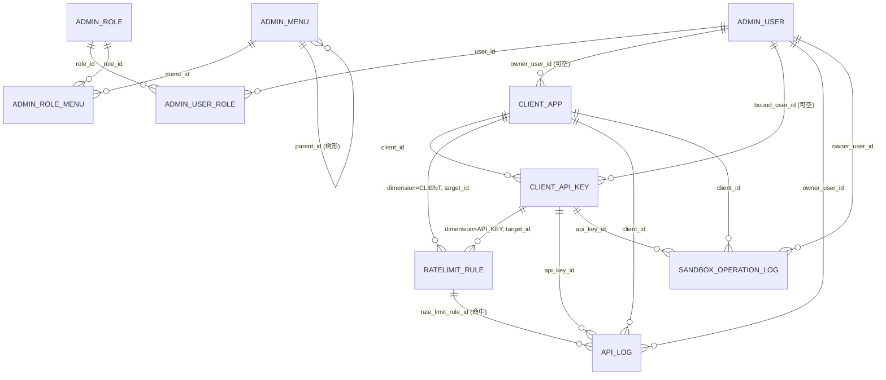

# 三工程共库 ER 与 schema 对齐资料（T-0008）

> 目标库：MySQL `sandbox`（utf8mb4 / utf8mb4_unicode_ci，蛇形命名）。
> 归属口径唯一真相来源：本文件 + `cross-cutting/database/schema/*.sql`。
> `admin-server/` 与 `python-sandbox/` **不通过代码模型共享对象**（不复制实体类、不共享常量），
> 仅通过对齐的列名与主键语义在数据层关联。

## 1. 表归属矩阵（唯一归属口径）

| 表 | DDL 归属（建表脚本） | 写入方 | 读取方 |
|----|----------------------|--------|--------|
| `api_log`（既有） | `python-sandbox/src/main/resources/db/init.sql` | `python-sandbox`（ApiLogAspect） | `python-sandbox`、`admin-server`（日志查询，只读） |
| `sandbox_operation_log`（既有） | 同上 | `python-sandbox`（SandboxOperationLogAspect） | `python-sandbox`、`admin-server`（只读） |
| `api_log` / `sandbox_operation_log` 扩展列 | `cross-cutting/database/schema/006-sandbox-log-extension.sql` | `python-sandbox`（T-0022 改造 Aspect 填充） | 双方 |
| `admin_user` / `admin_role` / `admin_menu` / `admin_user_role` / `admin_role_menu` | `schema/001-admin-rbac.sql` | `admin-server` | `admin-server` |
| `client_app` / `client_api_key` | `schema/002-client-apikey.sql` | `admin-server`（CRUD）；`python-sandbox` 只读校验（T-0023） | 双方 |
| `ratelimit_rule` | `schema/003-ratelimit.sql` | `admin-server`（CRUD）；`python-sandbox` 只读拉取（T-0024） | 双方 |
| `admin_login_log` / `admin_op_log` | `schema/004-admin-audit.sql` | `admin-server`（只追加） | `admin-server`（只读查询） |
| `sys_config` | `schema/005-sys-config.sql` | `admin-server` | `admin-server`；`python-sandbox` 只读匿名灰度/默认限流键（经 T-0024 拉取通道） |

## 2. 共库 ER（Mermaid）



## 3. 归属键一致性口径（核心）

所有涉密/涉权限数据的归属判定，统一使用以下三个键，任何表不得另立同义列名：

| 归属键 | 指向主键 | 出现位置 |
|--------|----------|----------|
| `client_id` | `client_app.id` | `client_api_key`、`api_log`、`sandbox_operation_log`、运行中会话快照（内存，经 `/internal` 透出） |
| `api_key_id` | `client_api_key.id` | `api_log`、`sandbox_operation_log`、`ratelimit_rule.target_id(dimension=API_KEY)`、运行中会话快照 |
| `owner_user_id` | `admin_user.id` | `client_app.owner_user_id`（可空）、`client_api_key.bound_user_id`（可空）、`api_log.owner_user_id`、`sandbox_operation_log.owner_user_id`、运行中会话快照 |

解析优先级（`python-sandbox` 鉴权上下文 → 日志归属；`admin-server` 数据权限 SELF 过滤同口径）：

```
owner_user_id = COALESCE(client_api_key.bound_user_id, client_app.owner_user_id)
```

即：ApiKey 绑定用户优先；未绑定则回落客户端归属用户；均为空则记录为无归属（仅管理员/审计员 ALL 可见域可见）。

## 4. ApiKey 认证关联链

```
X-Api-Key 明文（仅存在于请求瞬间）
  → SHA-256(明文) hex
  → client_api_key.key_hash（uk_client_api_key_hash，唯一命中）
  → client_api_key.client_id → client_app（status 联动拒绝：CLIENT_DISABLED）
  → COALESCE(bound_user_id, client_app.owner_user_id) → admin_user（status 联动拒绝：USER_DISABLED）
  → ratelimit_rule（dimension=API_KEY target_id=api_key.id；dimension=CLIENT target_id=client_id）
  → api_log.client_id / api_key_id / owner_user_id / rate_limit_hit / rate_limit_rule_id
```

`client_api_key.rate_limit_exempt = 1` 时跳过全部规则（白名单）。
`api_log.rate_limit_rule_id` 直接可关联 `ratelimit_rule.id`，无需中间表。

## 5. 与既有字段的兼容声明

- `api_log`、`sandbox_operation_log` 既有列（trace_id、session_id、api_path、operation_type、stdout 等）语义不变；扩展列全部可空或带默认值，旧写入路径不受影响。
- 会话归属：运行中会话不落库，`python-sandbox` 在会话创建时记录 `client_id / api_key_id / owner_user_id` 内存快照，经 `/internal/sandbox/sessions` 以同名字段透出，与日志归属键同名同义。
- 逻辑删除：管理端业务表统一 `deleted TINYINT`（0/1），与 MyBatis Plus 全局配置一致；审计两表不设逻辑删除（只追加口径）。

## 6. 种子数据链路自检（与 `seed/001-admin-seed.sql` 对应）

```
admin_user(1) --admin_user_role--> admin_role(1 superadmin)
admin_role(1) --admin_role_menu--> admin_menu 全集（M/C/F 三层完整）
admin_role(3 common)  --> 仅本人可见域业务菜单（无任何管理按钮删除权）
admin_role(4 auditor) --> 仅 view 类菜单，零按钮（只读）
sys_config            --> 8 个受控键（注册开关/失败阈值/锁定分钟/免登天数/三窗口默认限流/匿名灰度）
示例 ApiKey           --> status=4 已撤销 + plaintext_one_shot=0（列表识别用，不可调用）
```
